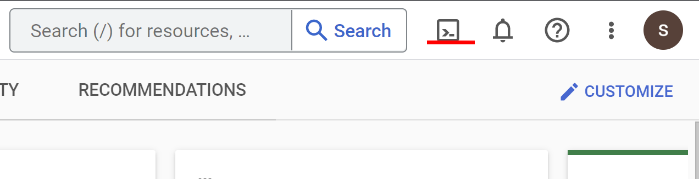
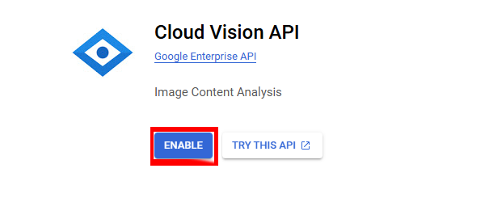
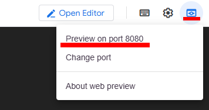
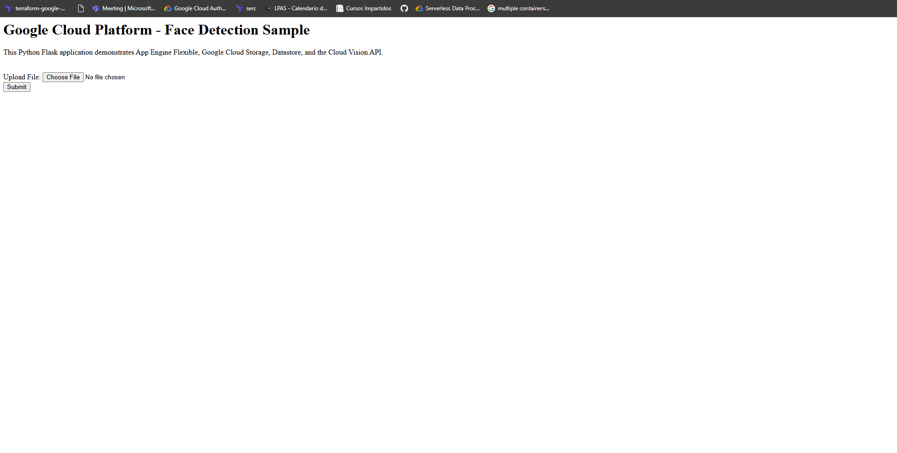

# Práctica 2. Introducción a App Engine 

## Objetivo de la práctica:
Al finalizar la práctica, serás capaz de:
- Crear y desplegar una aplicacción en App Engine.

## Duración aproximada:
- 60 minutos.

## Instrucciones 

### Tarea 1. Ingresar a la Consola en Google Cloud y configurar el proyecto en Cloud Shell
Paso 1. Abrir la Consola de Google, desde <a href="https://console.cloud.google.com/">aquí</a>

Paso 2. Iniciar sesión.

Paso 3. Abrir Cloud Shell.



Paso 4. Verificar que la cuenta esta siendo usada en Cloud Shell con el comando:

```
    gcloud auth list
```

Debe aparecer la cuenta activa. En caso de que no aparezca o salga una cuenta diferente, utiliza el comando:

```
gcloud config set acocunt `Tu cuenta`
```
Paso 5. Verificar que estes trabajando en el proyecto correcto con el comando:

```
gcloud config list project
```

Puedes encontrar el ID del proyecto en la parte superior izquierda al hacer click en el nombre del proyecto. Si el ID es distinto utilizar el comando:

```
gcloud config set project `ID-del-proyecto`
```
### Tarea 2. Descargar el código de muestra
Paso 1. Utilizar en Cloud Shell el siguiente comando:

```
gcloud storage cp -r gs://spls/gsp023/flex_and_vision/.
```

Paso 2. Cambiar al directorio "flex_and_vision". Utilizar el siguiente comando:

```
cd flex_and_vision
```

### Tarea 3. Habilitar las APIS requeridas

Paso 1. En el buscador, dentro de la consola, buscar "Cloud Vision API" y hacer click en habilitar.



Paso 2. En el buscador, dentro de la consola, buscar "Cloud Datastore API" y hacer click en habilitar.

Paso 3. En el buscador, dentro de la consola, buscar "Cloud Storage API" y hacer click en habilitar.

### Tarea 4. Crear una cuenta de servicio con los permisos adecuados para generar peticiones a las APIs habilitadas

Paso 1. Crear una variable de entorno en la cual se guarde el ID del proyecto. En Cloud Shell utilizar el siguiente comando:

```
export MY_PROJECT_ID=$(gcloud config get-value project)
```

Paso 2. Crear una variable de entorno en la cual se guarde la region a usar. En Cloud Shell utilizar el siguiente comando:

```
export APP_REGION=us-central1
```

Paso 3. Crear una cuenta de servicio que pueda acceder a las APIs cuando se hagan pruebas locales. Utilizar el siguiente comando:

```gcloud iam service-accounts create my-service-account \
  --display-name "lab-service-account"
```

Paso 4. Proporcionar los permisos adecuados a la cuenta de servicio. Utilizar el siguiente comando:

```
gcloud projects add-iam-policy-binding ${MY_PROJECT_ID} \
--member serviceAccount:my-service-account@${MY_PROJECT_ID}.iam.gserviceaccount.com \
--role roles/owner
```

Paso 5. Generar una llave de cuenta de servicio. Utilizar el comando:

```
gcloud iam service-accounts keys create ~/key.json \
--iam-account my-service-account@${MY_PROJECT_ID}.iam.gserviceaccount.com
```

Paso 6. Crear una variable de entorno que guarde la ubicación donde se genero la llave de la cuenta de servicio. Utilizar el comando:

```
export GOOGLE_APPLICATION_CREDENTIALS="/home/${USER}/key.json"
```

### Tarea 5. Probar la aplicación de manera local

Paso 1. Crear un entorno aislado de Python 3 con virtualenv. En Cloud Shell utilizar el siguiente comando:

```
virtualenv -p python3 my-virtual-env
```

Paso 2. Entrar al entorno virtual llamado my-virtual-env. Utilizar el siguiente comando:

```
source my-virtual-env/bin/activate
```

Paso 3. Instalar las dependencias usando PIP. Utilizar el comando:

```
pip install -r requirements.txt
```

Paso 4. Crear una App de App Engine. Utilizar el comando:

```
gcloud app create --region=$APP_REGION
```

Paso 5. Crear una bucket de Cloud Storage. Utilizar el comando:

```
gsutil mb gs://${MY_PROJECT_ID}
```

Paso 6. Ejecutar la aplicación. Utilizar el comando:

```
python main.py
```

Paso 7. Una vez la aplicación se inicie, hacer click en el botón de Preview en Cloud Shell y elegir la opción *Preview on Port 8080*



Paso 8. Hacer la prueba subiendo una imagen a la aplicación. Cuando se terminen de hacer pruebas, regresar a Cloud Shell. Presionar *CTRL+C* para apagar el web server.

### Tarea 6. Explorar el Código

Paso 1. En Cloud Shell puedes encontrar todos los archivos de la aplicación, date unos minutos para verlos y trata de entenderlos.

Procura revisar to main.py, y to app.yaml que puedes encontrar dentro de la carpeta templates.

### Tarea 7. Preparar la aplicación para desplegarse en App engine flexible enviroment

Paso 1. Primero, modificar el archivo de configuración app.yaml. En Cloud Shell utilizar el siguiente comando:

```
nano app.yaml
```
Si prefieres usar algun otro editor como VIM o EMACS puedes usarlos igualmente.

Paso 2. Dentro del archivo, reemplazar <your-cloud-storage-bucket> con el nombre de la bucket creada en la tarea 5, paso 5. El nombre debe ser el ID del proyecto.

Paso 3. En el apartado de "env_variables", configurar un escalado manual. Añadir al final del archivo la siguiente linea de código:

```
manual_scaling:
  instances: 1
```

Paso 5. Cambiar la versión de python de 3 a 3.7.

Paso 6. Guardar y cerrar el archivo. En nano presionar *CTRL+X* despues *Y* y enter.

NOTA: 

Si el script no funciona, puedes intentar remplazarlo por lo siguiente: 

runtime: python311
env: standard
entrypoint: gunicorn -b :$PORT main:app
 
env_variables:
  CLOUD_STORAGE_BUCKET: emerald-circle-439315-d2

### Tarea 8. Desplegar la aplicación en App Engine Flexible enviroment

Paso 1. Actualizar el tiempo fuera de Cloud Build. En Cloud Shell utilizar el comando:

```
gcloud config set app/cloud_build_timeout 1000
```

Paso 2. Desplegar la aplicación. Utilizar el comando:

```
gcloud app deploy
```

Si aparece el mensaje *Do you want to continue (Y/n)?*, escribir *Y* y precionar Enter. Este proceso puede tardar hasta 10 minutos.

Paso 3. Una vez desplegada la app puedes abrir la app con la siguiente URL:

https://ID_DE_TU_PROYECTO.appspot.com

No olvides cambiar ID_DE_TU_PROYECTO por el ID del proyecto.


### Resultado esperado


¡Felicidades! Con esto haz concluido el segundo laboratorio. 
No olvides solicitar ayuda a tu entrenador para eliminar los recursos que recien creaste.
