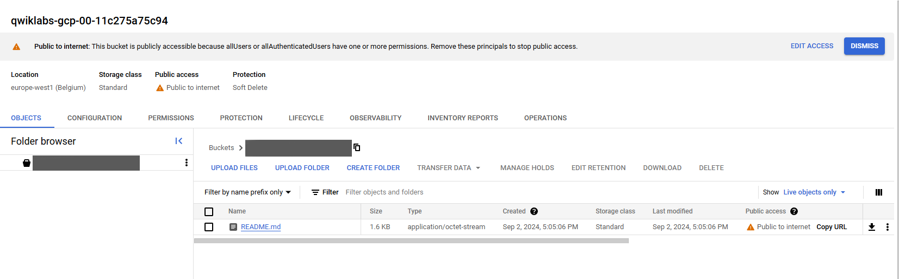

# Práctica 4. Introducción a Cloud Storage

## Objetivo de la práctica:
Al finalizar la práctica, serás capaz de:
- Crear buckets de Cloud Storage.
- Gestionar objetos dentro de Cloud Storage.

## Duración aproximada:
- 30 minutos.

## Instrucciones 

### Tarea 1. Ingresar a la Consola en Google Cloud y configurar el proyecto en Cloud Shell.
Paso 1. Abrir la Consola de Google, desde <a href="https://console.cloud.google.com/">aquí</a>

Paso 2. Iniciar sesión.

Paso 3. Abrir Cloud Shell.


Paso 4. Verificar que la cuenta esta siendo usada en Cloud Shell con el comando:

```
    gcloud auth list
```

Debería aparecer la cuenta activa. En caso de que no aparezca o salga una cuenta diferente, utiliza el comando:

```
gcloud config set acocunt `Tu cuenta`
```
Paso 5. Verificar que estes trabajando en el proyecto correcto con el comando:

```
gcloud config list project
```

Puedes encontrar el ID del proyecto en la parte superior izquierda al hacer click en el nombre del proyecto. Si el ID es distinto utilizar el comando:

```
gcloud config set project `ID-del-proyecto`
```
### Tarea 2. Acceder a Cloud Storage
Paso 1.  En el menú de navegación, desplazarce hacia abajo y hacer clic en "Storage" > "Buckets".


### Tarea 3. Crear un Bucket de Cloud Storage
Paso 1. Hacer clic en el botón *Create* dentro de la página de Cloud Storage.

Paso 2. Asignar un nombre único al bucket utilizando el ID del proyecto. Ejemplo:

- ID_DEL_PROYECTO-storageLab.

Paso 3. Configurar la bucket con las siguientes caracterizticas:

| Configuración | Valor | 
| Location type | Region | 
| Location | us-west4 |
| Storage Class | Standard |

El resto dejarlo en los predeterminados y hacer click en *CREATE*.


### Tarea 4. Subir Objetos al bucket
Paso 1. Asegurarse de estar dentro de la bucket recien creada.

Paso 2. Hacer click en el botón *Upload Files* para seleccionar un archivo de la computadora. Se puede subir cualquier archivo, unicamente debe asegurarse que no sea algo de gran tamaño para no usar tanto tiempo esperando a la carga.

### Tarea 5. Configurar permisos de acceso público
Paso 1. Asegurarse que el objeto este cargado en el bucket. Puede refrescar la página haciendo click en el botton de *Refresh*.

Paso 2. Abrir la pestaña de *Permissions*.

Paso 3. Hacer click en *REMOVE PUBLIC ACCESS PREVENTION* y despues en *Confirm*.

Paso 4. Hacer click en *GRANT ACCESS*.

Paso 6. En "new principals" escribir allUsers.

Paso 7. Asignar el rol *Storage Object Viewer*.

Paso 8. Hacer Click en *Save*.

### Tarea 6. Interactuar con el objeto
Paso 1. Regresar a la pestaña de *Objects*.

Paso 2. Hacer click en el objeto que se había subido para abrir sus detalles.

Paso 3. Copiar el URL público para acceder al objeto.

Paso 4. Utilizar el URL en el navegador para acceder al objeto.

### Resultado esperado


¡Felicidades! Con esto haz concluido tu cuarto laboratorio. 
No olvides solicitar ayuda a tu entrenador para eliminar los recursos que recien creaste.
