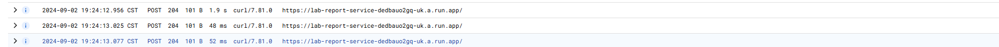
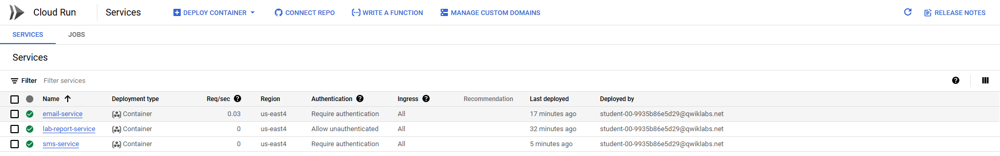

# Práctica 6. Introducción a Pub/Sub

## Objetivo de la práctica:
Al finalizar la práctica, serás capaz de:
- Crear tópicos de pub/sub.
- Utilizar los tópicos de pub/sub en tus aplicacciónes.

## Duración aproximada:
- 60 minutos.

## Instrucciones 

### Tarea 1. Ingresar a la Consola en Google Cloud y configurar el proyecto en Cloud Shell
Paso 1. Abrir la Consola de Google, desde <a href="https://console.cloud.google.com/">aquí</a>

Paso 2. Iniciar sesión.

Paso 3. Abrir Cloud Shell.


Paso 4. Verificar que la cuenta esta siendo usada en Cloud Shell con el comando:

```
    gcloud auth list
```

Deberia aparecer la cuenta activa. En caso de que no aparezca o salga un cuenta diferente, utiliza el comando:

```
gcloud config set acocunt `Tu cuenta`
```
Paso 5. Verificar que estes trabajando en el proyecto correcto con el comando:

```
gcloud config list project
```

Puedes encontrar el ID del proyecto en la parte superior izquierda al hacer click en el nombre del proyecto. Si el ID es distinto utilizar el comando:

```
gcloud config set project `ID-del-proyecto`
```

Paso 6. Habilitar las APIs requeridas. Utilizar el siguiente comando:

```
gcloud services enable run.googleapis.com
```

Paso 7. Crear una variable de entorno con el número de proyecto. Utilizar el comando:

```
export PROJECT_NUMBER=$(gcloud projects list --filter="qwiklabs-gcp" --format='value(PROJECT_NUMBER)')
```

### Tarea 2. Crear un Tópico de Pub/Sub
Paso 1. Crear un tópico de Pub/Sub. En Cloud Shell utilizar el siguiente comando:

```
gcloud pubsub topics create my-first-topic
```
### Tarea 3. Descargar y preparar el código muestra
Paso 1. Descargar el código muestra necesario para el laboratorio. Utilizar el siguiente comando:

```
git clone https://github.com/rosera/pet-theory.git
```

Paso 2. Cambiar al directorio *pet-theory/lab05/lab-service*. Utilizar el comando:

```
cd pet-theory/lab05/lab-service
```

Paso 3. Instalar los paquetes express, body-parser y de pub/sub. Utilizar el comando:

```
npm install express
npm install body-parser
npm install @google-cloud/pubsub
```

Paso 4. Abrir el aarchivo package.json. Utilizar el comando:

```
nano package.json
```
Puedes utilizar el editor de tu preferencia (VIM, Nano etc.)

Paso 5. En la linea 7, en el apartado de scripts, añadir *"start" : "node index.js",*. La sección debería verse así:

```json
  "scripts": {
    "start": "node index.js",
    "test": "echo \"Error: no test specified\" && exit 1"
  },
```
Paso 6. Crear un archivo nuevo llamado index.js con el siguiente contenido:

```
const {PubSub} = require('@google-cloud/pubsub');
const pubsub = new PubSub();
const express = require('express');
const app = express();
const bodyParser = require('body-parser');
app.use(bodyParser.json());
const port = process.env.PORT || 8080;

app.listen(port, () => {
  console.log('Listening on port', port);
});

app.post('/', async (req, res) => {
  try {
    const labReport = req.body;
    await publishPubSubMessage(labReport);
    res.status(204).send();
  }
  catch (ex) {
    console.log(ex);
    res.status(500).send(ex);
  }
})

async function publishPubSubMessage(labReport) {
  const buffer = Buffer.from(JSON.stringify(labReport));
  await pubsub.topic('my-first-topic').publish(buffer);
}
```

Utilizar el comando: 

```
nano index.js
```

Paso 7. Crear un archivo Dockerfile con el siguiente contenido:

```
FROM node:18
WORKDIR /usr/src/app
COPY package.json package*.json ./
RUN npm install --only=production
COPY . .
CMD [ "npm", "start" ]
```

Utilizar el comando:

```
nano Dockerfile
```

### Tarea 4. Desplegar el código del servicio Lab Report
Paso 1. Crear un archivo llamado deploy.sh con el siguiente contenido:

```
gcloud builds submit \
  --tag gcr.io/$GOOGLE_CLOUD_PROJECT/lab-report-service
gcloud run deploy lab-report-service \
  --image gcr.io/$GOOGLE_CLOUD_PROJECT/lab-report-service \
  --platform managed \
  --region us-east4 \
  --allow-unauthenticated \
  --max-instances=1
```

Utilizar el comando:

```
nano deploy.sh
```

Paso 2. Volver el archivo ejecutable. Utilizar el comando:

```
chmod u+x deploy.sh
```

Paso 3. Ejecutar el script de despliegue. Utilizar el comando:

```
./deploy.sh
```

Paso 4. Guardar la URL del servicio en una variable de entorno. Utilizar el comando:

```
export LAB_REPORT_SERVICE_URL=$(gcloud run services describe lab-report-service --platform managed --region us-east4 --format="value(status.address.url)")
```

Paso 5. Confirmar que la variable de entorno tenga el URL. Utilizar el comando:

```
echo $LAB_REPORT_SERVICE_URL
```

Paso 6. Crear un archivo llamado post-reports.sh con el siguiente contenido:

```
curl -X POST \
  -H "Content-Type: application/json" \
  -d "{\"id\": 12}" \
  $LAB_REPORT_SERVICE_URL &
curl -X POST \
  -H "Content-Type: application/json" \
  -d "{\"id\": 34}" \
  $LAB_REPORT_SERVICE_URL &
curl -X POST \
  -H "Content-Type: application/json" \
  -d "{\"id\": 56}" \
  $LAB_REPORT_SERVICE_URL &
```

Utilizar el comando:

```
nano post-reports.sh
```

Paso 7. Hacer que el archivo sea ejecutable. Utilizar el comando:

```
chmod u+x post-reports.sh
```

Paso 8. Ejecutar el archivo, el cual debería generar 3 reportes en la aplicación. Utilizar el comando:

```
./post-reports.sh
```

Paso 9. Ve a la pagína de Cloud Run y abre el servicio desplegado. Puedes ir a la pestaña de logs para corroborar que se generaron 3 entradas se muestras como:



### Tarea 5. Preparar el código del servicio Email
Paso 1. Cambiar al directorio *lab05/email-service*. Utilizar el comando:

```
cd ~/pet-theory/lab05/email-service
```

Paso 2. Instalar express y body-parser. Utilizar el comando:

```
npm install express
npm install body-parser
```

Paso 3. En la linea 7, en el apartado de scripts, añadir *"start" : "node index.js",*. La sección debería verse así:

```json
  "scripts": {
    "start": "node index.js",
    "test": "echo \"Error: no test specified\" && exit 1"
  },
```

Paso 4. Crear un archivo llamado index.js con el siguiente contenido:

```
const express = require('express');
const app = express();
const bodyParser = require('body-parser');
app.use(bodyParser.json());

const port = process.env.PORT || 8080;
app.listen(port, () => {
  console.log('Listening on port', port);
});

app.post('/', async (req, res) => {
  const labReport = decodeBase64Json(req.body.message.data);
  try {
    console.log(`Email Service: Report ${labReport.id} trying...`);
    sendEmail();
    console.log(`Email Service: Report ${labReport.id} success :-)`);
    res.status(204).send();
  }
  catch (ex) {
    console.log(`Email Service: Report ${labReport.id} failure: ${ex}`);
    res.status(500).send();
  }
})

function decodeBase64Json(data) {
  return JSON.parse(Buffer.from(data, 'base64').toString());
}

function sendEmail() {
  console.log('Sending email');
}
```

Utilizar el comando:

```
nano index.js
```

Paso 5. Crear un archivo Dockerfile con el siguiente contenido:

```
FROM node:18
WORKDIR /usr/src/app
COPY package.json package*.json ./
RUN npm install --only=production
COPY . .
CMD [ "npm", "start" ]
```

Utilizar el comando:

```
nano Dockerfile
```

### Tarea 6. Desplegar el código del servicio Email
Paso 1. Crear un archivo llamado deploy.sh con el siguiente contenido:

```
gcloud builds submit \
  --tag gcr.io/$GOOGLE_CLOUD_PROJECT/email-service

gcloud run deploy email-service \
  --image gcr.io/$GOOGLE_CLOUD_PROJECT/email-service \
  --platform managed \
  --region us-east4 \
  --no-allow-unauthenticated \
  --max-instances=1
```

Utilizar el comando

```
nano deploy.sh
```

Paso 2. Hacer al archivo ejecutable. Utilizar el comando:

```
chmod u+x deploy.sh
```

Paso 3. Ejecutar el archivo. Utilizar el comando:

```
./deploy.sh
```

### Tarea 7. Configurar Pub/Sub para hacer trigger a nuestro Servicio de Email
Paso 1. Crear una cuenta de servicio para Pub/Sub. Utilizar el comando:

```
gcloud iam service-accounts create pubsub-cloud-run-invoker --display-name "PubSub Cloud Run Invoker"
```

Paso 2. Proveer a la cuenta de servicio con los accesos adecuados. Utilizar el comando:

```
gcloud run services add-iam-policy-binding email-service --member=serviceAccount:pubsub-cloud-run-invoker@$GOOGLE_CLOUD_PROJECT.iam.gserviceaccount.com --role=roles/run.invoker --region us-east4 --platform managed
```

Paso 3. Habilitar a Pub/Sub al crear tokens de autentificación. Utilizar el comando: 

```
gcloud projects add-iam-policy-binding $GOOGLE_CLOUD_PROJECT --member=serviceAccount:service-$PROJECT_NUMBER@gcp-sa-pubsub.iam.gserviceaccount.com --role=roles/iam.serviceAccountTokenCreator
```

Paso 4. Generar una variable de entorno para el URL del servicio. Utilizar el comando:

```
exportEMAIL_SERVICE_URL=$(gcloud run services describe email-service --platform managed --region us-east4 --format="value(status.address.url)")
```

Paso 5. Corroborar que la variable de entorno tenga la URL. Utilizar el comando:

```
echo $EMAIL_SERVICE_URL
```

Paso 7. Crear una suscripción para el servicio de Email. Utilizar el comando:

```
gcloud pubsub subscriptions create email-service-sub --topic my-first-topic --push-endpoint=$EMAIL_SERVICE_URL --push-auth-service-account=pubsub-cloud-run-invoker@$GOOGLE_CLOUD_PROJECT.iam.gserviceaccount.com
```

Paso 8. Probar el servicio de Email. Utilizar el siguiente comando:

```
~/pet-theory/lab05/lab-service/post-reports.sh
```

Paso 7. Corroborar que están funcionando, de la misma manera en que se corroboro el servicio anterior.


### Tarea 8. Servicio de SMS
Paso 1. Cambiar al directorio *pet-theory/lab05/sms-service*. Utilza el comando:

```
cd ~/pet-theory/lab05/sms-service
```

Paso 2. Instalar los paquetes expres y body-parser. Utilizar el comando:

```
npm install express
npm install body-parser
```

Paso 3. En la linea 7, en el apartado de scripts, añadir *"start" : "node index.js",*. La sección debería verse así:

```json
  "scripts": {
    "start": "node index.js",
    "test": "echo \"Error: no test specified\" && exit 1"
  },
```

Paso 4. Crear un archivo llamado index.js con el siguiente contenido:

```
const express = require('express');
const app = express();
const bodyParser = require('body-parser');
app.use(bodyParser.json());

const port = process.env.PORT || 8080;
app.listen(port, () => {
  console.log('Listening on port', port);
});

app.post('/', async (req, res) => {
  const labReport = decodeBase64Json(req.body.message.data);
  try {
    console.log(`SMS Service: Report ${labReport.id} trying...`);
    sendSms();

    console.log(`SMS Service: Report ${labReport.id} success :-)`);    
    res.status(204).send();
  }
  catch (ex) {
    console.log(`SMS Service: Report ${labReport.id} failure: ${ex}`);
    res.status(500).send();
  }
})

function decodeBase64Json(data) {
  return JSON.parse(Buffer.from(data, 'base64').toString());
}

function sendSms() {
  console.log('Sending SMS');
}
```

Utilizar el comando:

```
nano index.js
```

Paso 5. Crear un archivo Dockerfile con el siguiente contenido:

```
FROM node:18
WORKDIR /usr/src/app
COPY package.json package*.json ./
RUN npm install --only=production
COPY . .
CMD [ "npm", "start" ]
```

Utilizar el comando:

```
nano Dockerfile
```

### Tarea 9. Desplegar el servicio SMS
Paso 1. Crear un archivo llamado deploy.sh con el siguiente contenido:

```
gcloud builds submit \
  --tag gcr.io/$GOOGLE_CLOUD_PROJECT/sms-service

gcloud run deploy sms-service \
  --image gcr.io/$GOOGLE_CLOUD_PROJECT/sms-service \
  --platform managed \
  --region us-east4 \
  --no-allow-unauthenticated \
  --max-instances=1
```

Utilizar el comando:

```
nano deploy.sh
```

Paso 2. Hacer el archivo ejecutable. Utilizar el comando:

```
chmod u+x deploy.sh
```

Paso 3. Ejecutar el archivo. Utilizar el comando:

```
./deploy.sh
```

### Tarea 10. Pub/Sub trigger a servicio SMS
Paso 1. Añadir los permisos necesarios a Pub/Sub. Utilizar el comando:

```
gcloud run services add-iam-policy-binding sms-service --member=serviceAccount:pubsub-cloud-run-invoker@$GOOGLE_CLOUD_PROJECT.iam.gserviceaccount.com --role=roles/run.invoker --region us-east4 --platform managed
```

Paso 2. Hacer que Pub/Sub invoque el servicio de SMS cuando se publiquen nuevos reportes. Utilizar el comando:

```
SMS_SERVICE_URL=$(gcloud run services describe sms-service --platform managed --region us-east4 --format="value(status.address.url)")
```

Paso 3. Crear una variable de entorno con la URL del servicio de SMS. Utilizar el comando:

```
SMS_SERVICE_URL=$(gcloud run services describe sms-service --platform managed --region us-east4 --format="value(status.address.url)")
```

Paso 4. Corroborar que la variable tenga la URL. Utilizar el comando:

```
echo $SMS_SERVICE_URL
```

Paso 5. Crear la suscripción de Pub/Sub para el servicio. Utilizar el comando:

```
gcloud pubsub subscriptions create sms-service-sub --topic my-first-topic --push-endpoint=$SMS_SERVICE_URL --push-auth-service-account=pubsub-cloud-run-invoker@$GOOGLE_CLOUD_PROJECT.iam.gserviceaccount.com
```

Paso 7. Ejecutar la prueba del servicio. Utilizar el comando: 

```
~/pet-theory/lab05/lab-service/post-reports.sh
```

Paso 8. Revisar los logs del servicio SMS para corroborar su funcionamiento.

### Resultado esperado



¡Felicidades! Con esto haz concluido tu sexto laboratorio. 
No olvides solicitar ayuda a tu entrenador para eliminar los recursos que recien creaste.
