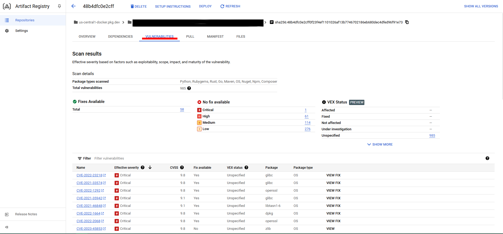

# Práctica 7. Introducción a Cloud Build

## Objetivo de la práctica:
Al finalizar la práctica, serás capaz de:
- Crear imagenes utilizando Cloud Build.
- Hacer un analisis de vulnerabilidad.
- Y Escanear en una Pipeline de CI/CD con Cloud Build.

## Duración aproximada:
- 110 minutos.

## Instrucciones 

### Tarea 1. Ingresar a la Consola en Google Cloud y configurar el proyecto en Cloud Shell
Paso 1. Abrir la Consola de Google desde <a href="https://console.cloud.google.com/">aquí</a>

Paso 2. Iniciar sesión.

Paso 3. Abrir Cloud Shell.


Paso 4. Verificar que la cuenta esta siendo usada en Cloud Shell con el comando:

```
    gcloud auth list
```

Deberia aparecerte la cuenta activa. En caso de que no aparezca o salga un cuenta diferente, utilizar el comando:

```
gcloud config set acocunt `Tu cuenta`
```
Paso 5. Verificar que estes trabajando en el proyecto correcto con el comando:

```
gcloud config list project
```

Puedes encontrar el ID del proyecto en la parte superior izquierda al hacer click en el nombre del proyecto. Si el ID es distinto utiliza el comando:

```
gcloud config set project `ID-del-proyecto`
```
### Tarea 2. Preparar tu entorno para el laboratorio
Paso 1. Crear las variables de entorno para el proyecto y número del proyecto. Utilizar el siguiente comando en Cloud Shell:

```
export PROJECT_ID=$(gcloud config get-value project)
export PROJECT_NUMBER=$(gcloud projects describe $PROJECT_ID \
    --format='value(projectNumber)')
```

Paso 2. Habilitar todos los servicios y APIs requeridas para este laboratorio. Utilizar el siguiente comando:

```
gcloud services enable \
  cloudkms.googleapis.com \
  cloudbuild.googleapis.com \
  container.googleapis.com \
  containerregistry.googleapis.com \
  artifactregistry.googleapis.com \
  containerscanning.googleapis.com \
  ondemandscanning.googleapis.com \
  binaryauthorization.googleapis.com
```

Paso 3. Proveer de acceso a la cuenta de servicio de Cloud Build. En Cloud Shell utilizar el comando:

```
gcloud projects add-iam-policy-binding ${PROJECT_ID} \
        --member="serviceAccount:${PROJECT_NUMBER}@cloudbuild.gserviceaccount.com" \
        --role="roles/iam.serviceAccountUser"

gcloud projects add-iam-policy-binding ${PROJECT_ID} \
        --member="serviceAccount:${PROJECT_NUMBER}@cloudbuild.gserviceaccount.com" \
        --role="roles/ondemandscanning.admin"
```

Paso 4. Crear un directorio sobre el cual vas a trabajar. Utilizar el comando:

```
mkdir lab && cd lab
```

### Tarea 3. Crear un pipeline automatizado para construir los Contenedores
Paso 1. Crear un archivo dockerfile con los siguientes contenidos:

```
cat > ./Dockerfile << EOF
FROM gcr.io/google-appengine/debian10@sha256:d25b680d69e8b386ab189c3ab45e219fededb9f91e1ab51f8e999f3edc40d2a1

# System
RUN apt update && apt install python3-pip -y

# App
WORKDIR /app
COPY . ./

RUN pip3 install Flask==1.1.4  
RUN pip3 install gunicorn==20.1.0  

CMD exec gunicorn --bind :$PORT --workers 1 --threads 8 --timeout 0 main:app

EOF
```

Paso 2. Crear un archivo python con los siguientes contenidos:

```
cat > ./main.py << EOF
import os
from flask import Flask

app = Flask(__name__)

@app.route("/")
def hello_world():
    name = os.environ.get("NAME", "Worlds")
    return "Hello {}!".format(name)

if __name__ == "__main__":
    app.run(debug=True, host="0.0.0.0", port=int(os.environ.get("PORT", 8080)))
EOF
```

Paso 3. Crear el archivo yaml de configuración para Cloud Build. Utilizar el siguiente comando:

```
cat > ./cloudbuild.yaml << EOF
steps:

# build
- id: "build"
  name: 'gcr.io/cloud-builders/docker'
  args: ['build', '-t', 'us-central1-docker.pkg.dev/${PROJECT_ID}/my-first-artifact-repository/sample-image', '.']
  waitFor: ['-']


EOF
```

Paso 4. Ejecutar la pipeline. Utilizar el comando:

```
gcloud builds submit
```
Puedes abrir Cloud Build en la consola para ver el contenido del Build.

### Tarea 4. Utilizar Artifact Registry para guardar las imagenes
Paso 1. Crear un repositorio de Artifact Registry. Utilizar el siguiente comando:

```
gcloud artifacts repositories create my-first-artifact-repository \
  --repository-format=docker \
  --location=us-central1 \
  --description="Docker repository"
```

Paso 2. Configurar docker para utilizar las credenciales de gcloud para acceder a Artifact Registry. Utilizar el comando:

```
gcloud auth configure-docker us-central1-docker.pkg.dev
```

Paso 3. Modificar la Pipeline de Cloud Build para subir la imagen resultante a Artifact registry. Utilizar el siguiente comando:

```
cat > ./cloudbuild.yaml << EOF
steps:

# build
- id: "build"
  name: 'gcr.io/cloud-builders/docker'
  args: ['build', '-t', 'us-central1-docker.pkg.dev/${PROJECT_ID}/my-first-artifact-repository/sample-image', '.']
  waitFor: ['-']

# push to artifact registry
- id: "push"
  name: 'gcr.io/cloud-builders/docker'
  args: ['push',  'us-central1-docker.pkg.dev/${PROJECT_ID}/my-first-artifact-repository/sample-image']

images:
  - us-central1-docker.pkg.dev/${PROJECT_ID}/my-first-artifact-repository/sample-image
EOF
```

Paso 4. Ejecutar la pipeline. Utilizar el comando:

```
gcloud builds submit
```

### Tarea 5. Automatizar el escaneo de vulnerabilidad
Vamos primero a visualizar los resultados vulnerabilidad.

Paso 1. Abrir en la consola Artifact Registry. Utilizar el buscador para encontrarlo.

Paso 2. Hacer click en el repositorio *my-first-artifact-repository* para ver los contenidos.

Paso 3. Hacer click en los detalles de la imagen.

Paso 4. Hacer click en el digito más reciente de la imagen.

Paso 5. Una vez finalizado el escaneo, hacer click en la pestaña *Vulnerabilities* de la imagen.



¡El auto escaneado esta habilitado por defecto! Esta sección fue solo para que exploraras los resultados.

### Tarea 6. Escanear bajo demanda
Paso 1. Utilizar docker de manera local para construir la imagen en cache. En Cloud Shell utilizar el comando:

```
docker build -t us-central1-docker.pkg.dev/${PROJECT_ID}/my-first-artifact-repository/sample-image.
```

Paso 2. Solicitar un escaneo de la imagen. Utilizar el comando:

```
gcloud artifacts docker images scan \
    us-central1-docker.pkg.dev/${PROJECT_ID}/my-first-artifact-repository/sample-image \
    --format="value(response.scan)" > scan_id.txt
```

Paso 3. Visualizar el resultado. Utilizar el comando:

```
gcloud artifacts docker images list-vulnerabilities $(cat scan_id.txt)
```

Paso 4. Leer los detalles y generar un log si alguna vulnerabilidad critica fue encontrada. Utilizar el comando:

```
export SEVERITY=CRITICAL

gcloud artifacts docker images list-vulnerabilities $(cat scan_id.txt) --format="value(vulnerability.effectiveSeverity)" | if grep -Fxq ${SEVERITY}; then echo "Failed vulnerability check for ${SEVERITY} level"; else echo "No ${SEVERITY} Vulnerabilities found"; fi
```

### Tarea 6. Escanear en una Pipeline de CI/CD en Cloud Build
Paso 1. Proveer a Cloud Build los accesos para la *scanning API*. Utilizar el comando:

```
gcloud projects add-iam-policy-binding ${PROJECT_ID} \
        --member="serviceAccount:${PROJECT_NUMBER}@cloudbuild.gserviceaccount.com" \
        --role="roles/iam.serviceAccountUser"

gcloud projects add-iam-policy-binding ${PROJECT_ID} \
        --member="serviceAccount:${PROJECT_NUMBER}@cloudbuild.gserviceaccount.com" \
        --role="roles/ondemandscanning.admin"
```

Paso 2. Actualizar tu Pipeline de Cloud Build con el contenido siguiente:

```
cat > ./cloudbuild.yaml << EOF
steps:

# build
- id: "build"
  name: 'gcr.io/cloud-builders/docker'
  args: ['build', '-t', 'us-central1-docker.pkg.dev/${PROJECT_ID}/my-first-artifact-repository/sample-image', '.']
  waitFor: ['-']

#Run a vulnerability scan at _SECURITY level
- id: scan
  name: 'gcr.io/cloud-builders/gcloud'
  entrypoint: 'bash'
  args:
  - '-c'
  - |
    (gcloud artifacts docker images scan \
    us-central1-docker.pkg.dev/${PROJECT_ID}/my-first-artifact-repository/sample-image \
    --location us \
    --format="value(response.scan)") > /workspace/scan_id.txt

#Analyze the result of the scan
- id: severity check
  name: 'gcr.io/cloud-builders/gcloud'
  entrypoint: 'bash'
  args:
  - '-c'
  - |
      gcloud artifacts docker images list-vulnerabilities \$(cat /workspace/scan_id.txt) \
      --format="value(vulnerability.effectiveSeverity)" | if grep -Fxq CRITICAL; \
      then echo "Failed vulnerability check for CRITICAL level" && exit 1; else echo "No CRITICAL vulnerability found, congrats !" && exit 0; fi

#Retag
- id: "retag"
  name: 'gcr.io/cloud-builders/docker'
  args: ['tag',  'us-central1-docker.pkg.dev/${PROJECT_ID}/my-first-artifact-repository/sample-image', 'us-central1-docker.pkg.dev/${PROJECT_ID}/my-first-artifact-repository/sample-image:good']


#pushing to artifact registry
- id: "push"
  name: 'gcr.io/cloud-builders/docker'
  args: ['push',  'us-central1-docker.pkg.dev/${PROJECT_ID}/my-first-artifact-repository/sample-image:good']

images:
  - us-central1-docker.pkg.dev/${PROJECT_ID}/my-first-artifact-repository/sample-image
EOF
```
Paso 3. Ejecutar tu Pipeline. Utilizar el comando:

```
gcloud builds submit
```
Podras observar que tenemos un error debido a una vulnerabilidad. Vamos a arreglarlo

Paso 4. Actualizar EL docker file con los siguientes contenidos:

```
cat > ./Dockerfile << EOF
FROM python:3.8-alpine 


# App
WORKDIR /app
COPY . ./

RUN pip3 install Flask==2.1.0
RUN pip3 install gunicorn==20.1.0
RUN pip3 install Werkzeug==2.2.2

CMD exec gunicorn --bind :\$PORT --workers 1 --threads 8 main:app

EOF
```

Paso 5. Ejecutar eñ Pipeline. Utilizar el comando:

```
gcloud builds submit
```

Paso 6. Observar los resultados en Artifact Registry. Puedes notar que disminuimos la cantidad de vulnerabilidades en nuestra imagen.

### Resultado esperado


¡Felicidades! Con esto haz concluido tu último laboratorio. 
No olvides solicitar ayuda a tu entrenador para eliminar los recursos que recien creaste.
